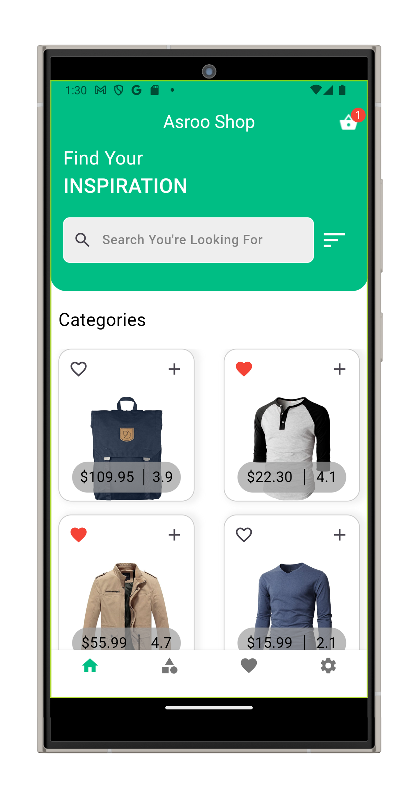
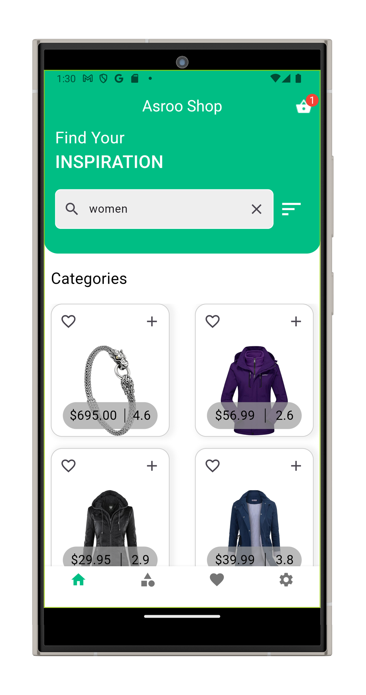
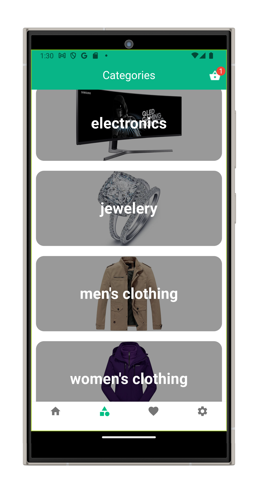
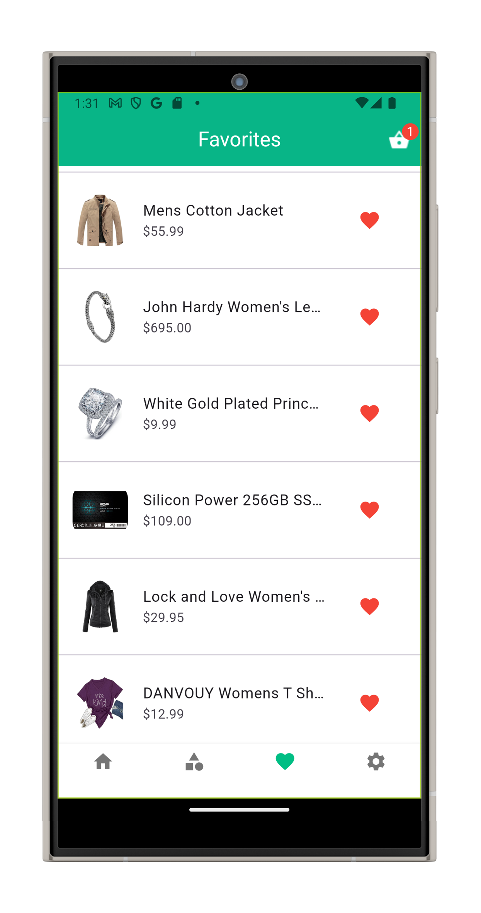
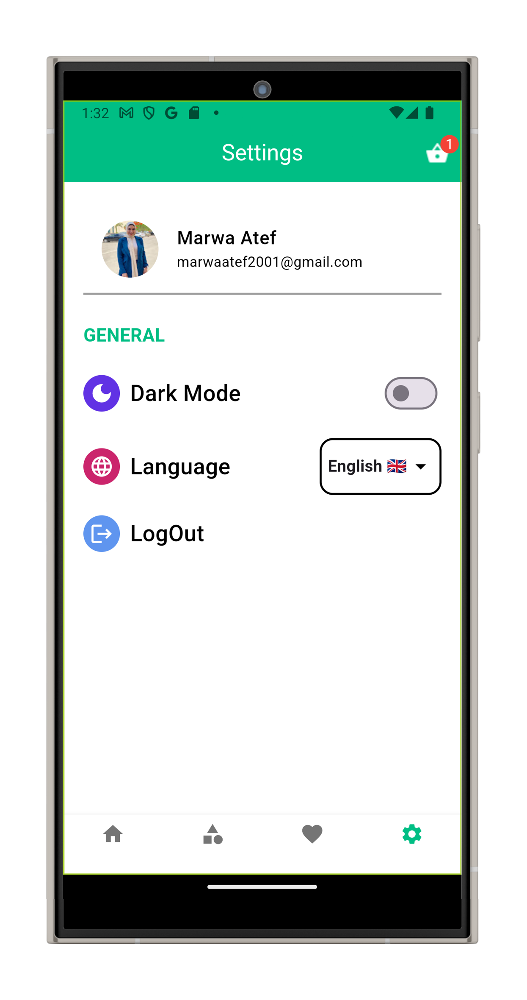
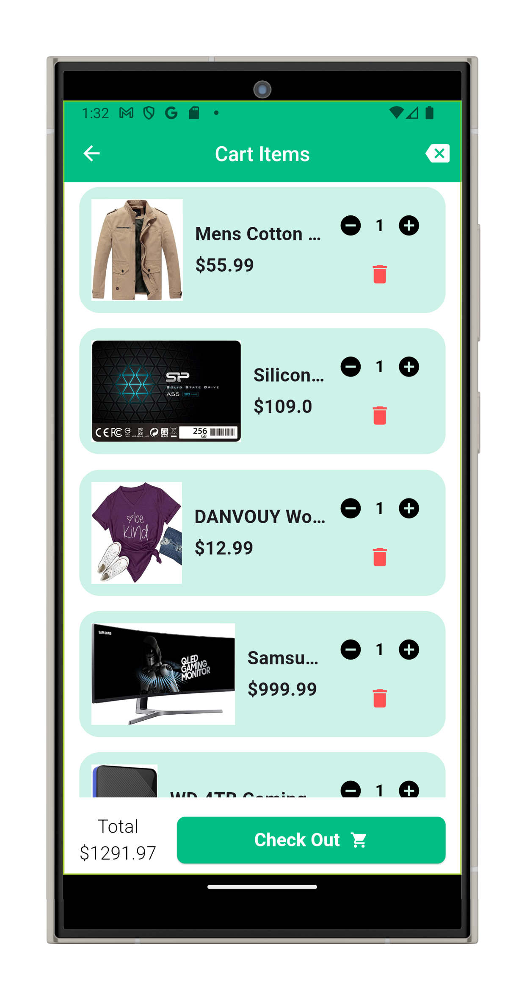
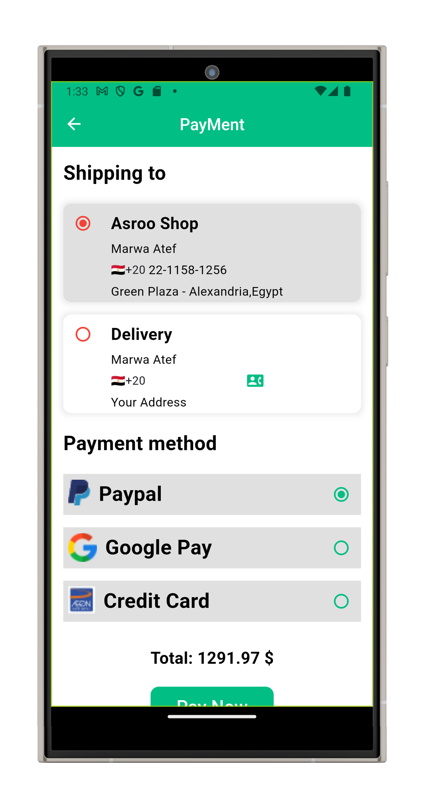

# ecommerce_app

A modern, responsive, and full-featured eCommerce application built using **Flutter**, **GetX**, and **Firebase**. This app includes product listing, authentication, cart management, order tracking, and more.
## ✨ Features

- 🛍️ Product browsing and search
- ❤️ Favorites and wishlists
- 🔐 Authentication (login/register)
- 📦 Cart and checkout flow
- 🚚 Address and delivery options
- 📍 Geolocation and user address autofill
- 🌙 Dark mode support
- 🔄 State management with GetX
- ☁️ Firebase backend (Database + Auth)

## 📸 Screenshots

  
  
  
  
  
  
  

